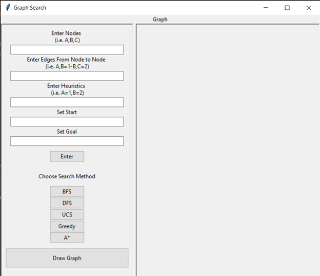
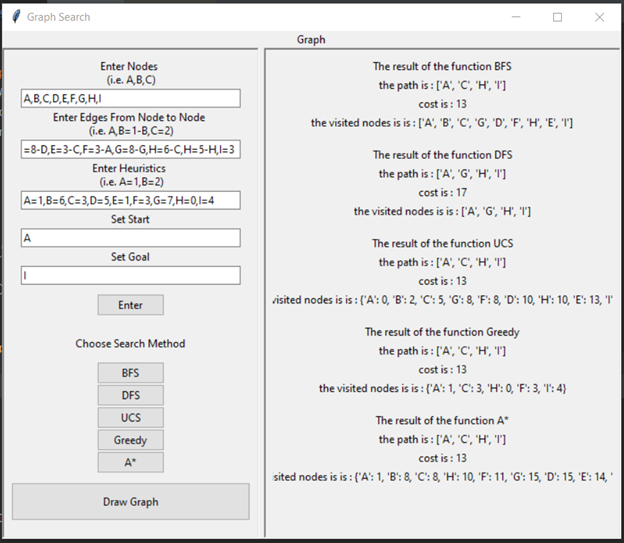
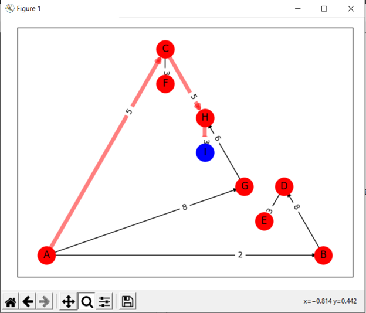

# Search Algorithm Application

This application implements various search algorithms to find the optimal path between a start node and a goal node in a graph. The search algorithms implemented in this application include:
* Breadth-First Search (BFS)
* Depth-First Search (DFS)
* Uniform-Cost Search (UCS)
* Greedy Best-First Search
* A* Search Algorithm

## Installation 
To use this project, you must have Python 3 installed on your system. If you do not have Python 3 installed, you can download it from the official website: https://www.python.org/downloads/

After installing Python 3, you can install the necessary dependencies using pip. To install the required packages, run the following command in your terminal or command prompt:

```
pip install -r requirements.txt
```

This command will install all the dependencies listed in the requirements.txt file, including the tkinter, matplotlib, and networkx libraries.

Alternatively, you can install each library individually using the following commands:

```

pip install tkinter
pip install matplotlib
pip install networkx
```

Once you have installed the dependencies, you can run the project by executing the main.py file.

## Usage

After the installation steps is done there is a format must stand by it to get a valid answer <br>

<br>

### Input restrictions

1. Enter nodes in the following format: Node1,Node2,Node3
2. Enter edges from node to node in the following format: Node1,Node2=Cost-Node2,Node3=Cost
3.	Enter heuristics of nodes if exists in the following format: Node1=Number,Node2=Number
4.	Enter chosen start node in the “Set Start” field.
5.	Enter chosen goal node in the “Set Goal” field.
6.	Press “Enter” button to save the inputs.
7.	Press the search method you choose.
8.	After pressing, the path, path cost, and visited nodes are shown on screen.
9. Press “Draw Graph” to see drawn graph of the last search method you pressed.

## Output

After following the instructions before for the result should be like this is a example of a graph made:
<br>

<br>
there is the option to draw graph the user must specify first the search algorithm to draw the graph accordingly. <br>
 <br>
After Entering Graph as in input to the system and choosing search technique; The search is executed by clicking on it's button and the graph is drawn by clicking on draw graph button where the path to goal is drawn by red and the goal is a blue node and also the path to goal is detected upon the last click on the search technique button meaning that the last button clicked detects the goal to path.
